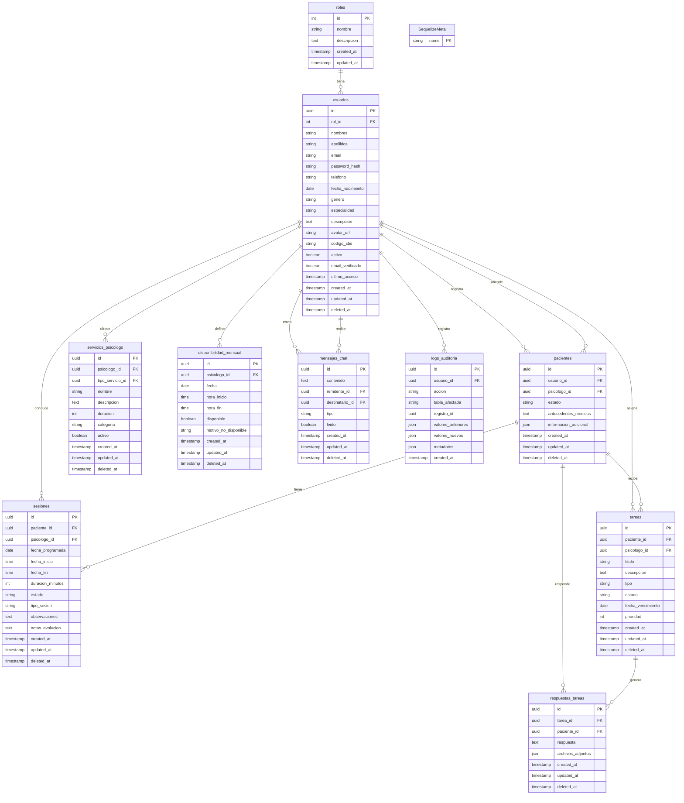

# Base de Datos - Centro Terapéutico Psyche

## Diagrama de Base de Datos

## Resumen de Tablas

| Tabla | Descripción | Registros Estimados |
|-------|-------------|-------------------|
| `roles` | Roles del sistema (admin, psicologo, recepcionista, paciente) | 4 |
| `usuarios` | Usuarios del sistema | ~100-500 |
| `pacientes` | Información específica de pacientes | ~50-200 |
| `sesiones` | Sesiones terapéuticas | ~1000-5000 |
| `tareas` | Tareas asignadas a pacientes | ~500-2000 |
| `respuestas_tareas` | Respuestas de pacientes a tareas | ~200-1000 |
| `servicios_psicologo` | Servicios ofrecidos por psicólogos | ~20-100 |
| `disponibilidad_mensual` | Disponibilidad mensual de psicólogos | ~1000-5000 |
| `mensajes_chat` | Mensajes del chat en tiempo real | ~5000-50000 |
| `logs_auditoria` | Logs de auditoría del sistema | ~10000-100000 |
| `SequelizeMeta` | Metadatos de migraciones | ~20 |

**Total: 11 tablas**
