# Modelo Entidad-Relación - Centro Terapéutico Psyche

## Diagrama ER en Tercera Forma Normal

```mermaid
erDiagram
    %% Entidades principales del sistema
    ROLES {
        int id PK "Clave primaria"
        string nombre UK "Nombre del rol"
        string descripcion "Descripción del rol"
        jsonb permisos "Permisos específicos"
        boolean activo "Estado activo"
        timestamp created_at "Fecha creación"
        timestamp updated_at "Fecha actualización"
        timestamp deleted_at "Fecha eliminación"
    }
    
    USUARIOS {
        uuid id PK "Clave primaria"
        string email UK "Email único"
        string password_hash "Hash de contraseña"
        string nombres "Nombres"
        string apellidos "Apellidos"
        string telefono "Teléfono"
        date fecha_nacimiento "Fecha nacimiento"
        enum genero "Género"
        string avatar_url "URL avatar"
        string especialidad "Especialidad"
        string descripcion "Descripción"
        string codigo_sbs "Código SBS"
        int rol_id FK "ID del rol"
        boolean activo "Estado activo"
        boolean email_verificado "Email verificado"
        string token_activacion "Token activación"
        timestamp token_activacion_expira "Expiración token"
        timestamp ultimo_acceso "Último acceso"
        jsonb configuracion "Configuración"
        timestamp created_at "Fecha creación"
        timestamp updated_at "Fecha actualización"
        timestamp deleted_at "Fecha eliminación"
    }
    
    PACIENTES {
        uuid id PK "Clave primaria"
        uuid usuario_id FK "ID usuario"
        uuid psicologo_id FK "ID psicólogo"
        string nombres "Nombres"
        string apellidos "Apellidos"
        string email "Email"
        string telefono "Teléfono"
        date fecha_nacimiento "Fecha nacimiento"
        enum genero "Género"
        string numero_ficha UK "Número ficha único"
        string rut UK "RUT único"
        string direccion "Dirección"
        string contacto_emergencia_nombre "Contacto emergencia"
        string contacto_emergencia_telefono "Teléfono emergencia"
        string contacto_emergencia_relacion "Relación emergencia"
        jsonb diagnosticos "Diagnósticos"
        jsonb etiquetas "Etiquetas"
        jsonb estrategias_autorregulacion "Estrategias"
        enum estado "Estado del paciente"
        date fecha_ingreso "Fecha ingreso"
        date fecha_alta "Fecha alta"
        string observaciones "Observaciones"
        jsonb antecedentes_medicos "Antecedentes médicos"
        jsonb medicacion_actual "Medicación actual"
        jsonb alergias "Alergias"
        jsonb condiciones_cronicas "Condiciones crónicas"
        jsonb historial_psiquiatrico "Historial psiquiátrico"
        string observaciones_medicas "Observaciones médicas"
        timestamp created_at "Fecha creación"
        timestamp updated_at "Fecha actualización"
        timestamp deleted_at "Fecha eliminación"
    }
    
    SESIONES {
        uuid id PK "Clave primaria"
        uuid paciente_id FK "ID paciente"
        uuid psicologo_id FK "ID psicólogo"
        timestamp fecha_programada "Fecha programada"
        timestamp fecha_inicio "Fecha inicio"
        timestamp fecha_fin "Fecha fin"
        int duracion_minutos "Duración en minutos"
        enum tipo_sesion "Tipo de sesión"
        enum estado "Estado de la sesión"
        text notas_evolucion "Notas de evolución"
        jsonb objetivos_sesion "Objetivos de la sesión"
        jsonb tecnicas_utilizadas "Técnicas utilizadas"
        jsonb evaluacion_paciente "Evaluación del paciente"
        text observaciones "Observaciones"
        text resumen_sesion "Resumen de la sesión"
        jsonb objetivos_alcanzados "Objetivos alcanzados"
        jsonb tareas_asignadas "Tareas asignadas"
        enum progreso_paciente "Progreso del paciente"
        jsonb derivacion_recomendada "Derivación recomendada"
        jsonb archivos_sesion "Archivos de la sesión"
        jsonb archivos_adjuntos "Archivos adjuntos"
        timestamp created_at "Fecha creación"
        timestamp updated_at "Fecha actualización"
        timestamp deleted_at "Fecha eliminación"
    }
    
    TAREAS {
        uuid id PK "Clave primaria"
        uuid paciente_id FK "ID paciente"
        uuid psicologo_id FK "ID psicólogo"
        uuid sesion_id FK "ID sesión"
        string titulo "Título de la tarea"
        text descripcion "Descripción"
        text instrucciones "Instrucciones"
        enum tipo_tarea "Tipo de tarea"
        string tipo_tarea_avanzado "Tipo avanzado"
        enum prioridad "Prioridad"
        timestamp fecha_asignacion "Fecha asignación"
        timestamp fecha_vencimiento "Fecha vencimiento"
        timestamp fecha_completada "Fecha completada"
        enum estado "Estado de la tarea"
        jsonb archivos_adjuntos "Archivos adjuntos"
        text respuesta_paciente "Respuesta del paciente"
        jsonb archivos_respuesta "Archivos de respuesta"
        jsonb evaluacion_psicologo "Evaluación del psicólogo"
        jsonb contenido_tarea "Contenido de la tarea"
        jsonb configuracion_tarea "Configuración"
        boolean es_borrador "Es borrador"
        timestamp fecha_publicacion "Fecha publicación"
        timestamp created_at "Fecha creación"
        timestamp updated_at "Fecha actualización"
        timestamp deleted_at "Fecha eliminación"
    }
    
    RESPUESTAS_TAREAS {
        uuid id PK "Clave primaria"
        uuid tarea_id FK "ID tarea"
        uuid paciente_id FK "ID paciente"
        text contenido_respuesta "Contenido respuesta"
        text archivo_respuesta "Archivo respuesta"
        timestamp fecha_envio "Fecha envío"
        jsonb evaluacion_psicologo "Evaluación psicólogo"
        timestamp created_at "Fecha creación"
        timestamp updated_at "Fecha actualización"
    }
    
    SERVICIOS_PSICOLOGO {
        int id PK "Clave primaria"
        uuid psicologo_id FK "ID psicólogo"
        string tipo_servicio_id "ID tipo servicio"
        string nombre "Nombre del servicio"
        text descripcion "Descripción"
        int duracion "Duración en minutos"
        string categoria "Categoría"
        boolean activo "Estado activo"
        timestamp created_at "Fecha creación"
        timestamp updated_at "Fecha actualización"
    }
    
    DISPONIBILIDAD_MENSUAL {
        int id PK "Clave primaria"
        uuid psicologo_id FK "ID psicólogo"
        date fecha "Fecha específica"
        time hora_inicio "Hora inicio"
        time hora_fin "Hora fin"
        boolean activo "Estado activo"
        enum tipo_disponibilidad "Tipo disponibilidad"
        timestamp created_at "Fecha creación"
        timestamp updated_at "Fecha actualización"
        timestamp deleted_at "Fecha eliminación"
    }
    
    DISPONIBILIDAD_PSICOLOGOS {
        uuid id PK "Clave primaria"
        uuid psicologo_id FK "ID psicólogo"
        int dia_semana "Día de la semana"
        time hora_inicio "Hora inicio"
        time hora_fin "Hora fin"
        boolean activo "Estado activo"
        timestamp created_at "Fecha creación"
        timestamp updated_at "Fecha actualización"
    }
    
    CITAS {
        uuid id PK "Clave primaria"
        uuid paciente_id FK "ID paciente"
        uuid psicologo_id FK "ID psicólogo"
        date fecha "Fecha de la cita"
        time hora_inicio "Hora inicio"
        time hora_fin "Hora fin"
        int duracion_minutos "Duración en minutos"
        enum estado "Estado de la cita"
        enum tipo_sesion "Tipo de sesión"
        enum modalidad "Modalidad"
        text notas_paciente "Notas del paciente"
        text notas_psicologo "Notas del psicólogo"
        boolean recordatorio_enviado "Recordatorio enviado"
        timestamp created_at "Fecha creación"
        timestamp updated_at "Fecha actualización"
    }
    
    CHAT {
        uuid id PK "Clave primaria"
        uuid emisor_id FK "ID emisor"
        uuid receptor_id FK "ID receptor"
        text contenido "Contenido del mensaje"
        boolean leido "Mensaje leído"
        timestamp timestamp "Timestamp del mensaje"
        timestamp created_at "Fecha creación"
        timestamp updated_at "Fecha actualización"
    }
    
    LOGS_AUDITORIA {
        uuid id PK "Clave primaria"
        uuid usuario_id FK "ID usuario"
        string accion "Acción realizada"
        string tabla_afectada "Tabla afectada"
        string registro_id "ID del registro"
        jsonb valores_anteriores "Valores anteriores"
        jsonb valores_nuevos "Valores nuevos"
        inet ip_address "Dirección IP"
        text user_agent "User Agent"
        jsonb metadatos "Metadatos adicionales"
        timestamp created_at "Fecha creación"
    }

    %% Relaciones principales - organizadas por grupos
    %% Grupo 1: Gestión de usuarios y roles
    ROLES ||--o{ USUARIOS : "asigna_rol"
    
    %% Grupo 2: Gestión de pacientes
    USUARIOS ||--o{ PACIENTES : "es_paciente"
    USUARIOS ||--o{ PACIENTES : "atiende_como_psicologo"
    
    %% Grupo 3: Sesiones terapéuticas
    PACIENTES ||--o{ SESIONES : "participa_en"
    USUARIOS ||--o{ SESIONES : "realiza_como_psicologo"
    
    %% Grupo 4: Sistema de tareas
    SESIONES ||--o{ TAREAS : "genera"
    PACIENTES ||--o{ TAREAS : "recibe"
    USUARIOS ||--o{ TAREAS : "asigna_como_psicologo"
    TAREAS ||--o{ RESPUESTAS_TAREAS : "tiene_respuestas"
    PACIENTES ||--o{ RESPUESTAS_TAREAS : "responde"
    
    %% Grupo 5: Servicios y disponibilidad
    USUARIOS ||--o{ SERVICIOS_PSICOLOGO : "ofrece"
    USUARIOS ||--o{ DISPONIBILIDAD_MENSUAL : "tiene_disponibilidad_mensual"
    USUARIOS ||--o{ DISPONIBILIDAD_PSICOLOGOS : "tiene_disponibilidad_semanal"
    
    %% Grupo 6: Sistema de citas
    PACIENTES ||--o{ CITAS : "tiene_citas"
    USUARIOS ||--o{ CITAS : "atiende_citas"
    
    %% Grupo 7: Comunicación
    USUARIOS ||--o{ CHAT : "envia_mensajes"
    USUARIOS ||--o{ CHAT : "recibe_mensajes"
    
    %% Grupo 8: Auditoría
    USUARIOS ||--o{ LOGS_AUDITORIA : "genera_logs"
```

## Entidades del Sistema

### 1. ROLES
- **Propósito**: Definir tipos de usuario (admin, psicólogo, recepcionista, paciente)
- **Clave Primaria**: `id` (entero autoincremental)
- **Atributos Únicos**: `nombre`

### 2. USUARIOS
- **Propósito**: Información base de todos los usuarios del sistema
- **Clave Primaria**: `id` (UUID)
- **Claves Foráneas**: `rol_id` → ROLES
- **Atributos Únicos**: `email`

### 3. PACIENTES
- **Propósito**: Información específica de pacientes
- **Clave Primaria**: `id` (UUID)
- **Claves Foráneas**: 
  - `usuario_id` → USUARIOS
  - `psicologo_id` → USUARIOS
- **Atributos Únicos**: `numero_ficha`, `rut`

### 4. SESIONES
- **Propósito**: Registro de sesiones terapéuticas
- **Clave Primaria**: `id` (UUID)
- **Claves Foráneas**:
  - `paciente_id` → PACIENTES
  - `psicologo_id` → USUARIOS

### 5. TAREAS
- **Propósito**: Tareas asignadas a pacientes
- **Clave Primaria**: `id` (UUID)
- **Claves Foráneas**:
  - `paciente_id` → PACIENTES
  - `psicologo_id` → USUARIOS
  - `sesion_id` → SESIONES (opcional)

### 6. RESPUESTAS_TAREAS
- **Propósito**: Respuestas de pacientes a tareas
- **Clave Primaria**: `id` (UUID)
- **Claves Foráneas**:
  - `tarea_id` → TAREAS
  - `paciente_id` → PACIENTES

### 7. SERVICIOS_PSICOLOGO
- **Propósito**: Servicios ofrecidos por cada psicólogo
- **Clave Primaria**: `id` (entero autoincremental)
- **Clave Foránea**: `psicologo_id` → USUARIOS

### 8. DISPONIBILIDAD_MENSUAL
- **Propósito**: Horarios específicos de disponibilidad
- **Clave Primaria**: `id` (entero autoincremental)
- **Clave Foránea**: `psicologo_id` → USUARIOS

### 9. DISPONIBILIDAD_PSICOLOGOS
- **Propósito**: Horarios recurrentes por día de semana
- **Clave Primaria**: `id` (UUID)
- **Clave Foránea**: `psicologo_id` → USUARIOS

### 10. CITAS
- **Propósito**: Citas programadas
- **Clave Primaria**: `id` (UUID)
- **Claves Foráneas**:
  - `paciente_id` → PACIENTES
  - `psicologo_id` → USUARIOS

### 11. CHAT
- **Propósito**: Sistema de mensajería
- **Clave Primaria**: `id` (UUID)
- **Claves Foráneas**:
  - `emisor_id` → USUARIOS
  - `receptor_id` → USUARIOS

### 12. LOGS_AUDITORIA
- **Propósito**: Registro de auditoría del sistema
- **Clave Primaria**: `id` (UUID)
- **Clave Foránea**: `usuario_id` → USUARIOS (opcional)

## Relaciones Principales

1. **ROL → USUARIOS** (1:N): Un rol puede tener muchos usuarios
2. **USUARIOS → PACIENTES** (1:N): Un usuario puede ser paciente de un psicólogo
3. **USUARIOS → SESIONES** (1:N): Un psicólogo puede tener muchas sesiones
4. **PACIENTES → SESIONES** (1:N): Un paciente puede tener muchas sesiones
5. **SESIONES → TAREAS** (1:N): Una sesión puede generar muchas tareas
6. **TAREAS → RESPUESTAS_TAREAS** (1:N): Una tarea puede tener muchas respuestas
7. **USUARIOS → DISPONIBILIDAD** (1:N): Un psicólogo puede tener múltiples horarios
8. **USUARIOS → CHAT** (1:N): Un usuario puede enviar/recibir muchos mensajes

## Características del Diseño

### Campos JSONB
El sistema utiliza campos JSONB para almacenar datos estructurados:
- **`permisos`** en ROLES: Permisos específicos por rol
- **`diagnosticos`**, **`etiquetas`**, **`estrategias_autorregulacion`** en PACIENTES: Información clínica estructurada
- **`objetivos_sesion`**, **`tecnicas_utilizadas`** en SESIONES: Datos de la sesión
- **`contenido_tarea`**, **`configuracion_tarea`** en TAREAS: Configuración específica por tipo de tarea

### Soft Deletes
La mayoría de tablas implementan soft deletes con el campo `deleted_at` para mantener integridad referencial.

### Auditoría
La tabla `LOGS_AUDITORIA` registra todas las acciones importantes del sistema para cumplir con requerimientos de auditoría.

## Normalización

### Primera Forma Normal (1FN) ✅
- Todas las tablas tienen claves primarias únicas
- No hay grupos repetitivos (se usan JSONB para arrays estructurados)
- Todos los atributos son atómicos

### Segunda Forma Normal (2FN) ✅
- Todas las tablas están en 1FN
- No hay dependencias parciales de claves primarias compuestas
- Todos los atributos no clave dependen completamente de la clave primaria

### Tercera Forma Normal (3FN) ✅
- Todas las tablas están en 2FN
- No hay dependencias transitivas
- Los atributos no clave no dependen de otros atributos no clave

---
*Documento generado automáticamente - Centro Terapéutico Psyche*
